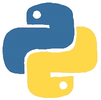

# Hi, I'm <a>Angga Rofiul Putra</a>! 





###   About Me

```javascript
const Ang = {
  pronouns: "he" | "him",
  Iam : ["Student in University Muhammadiyah Malang"],
  code: [Python, Java, SQL, Flutter,J avascript, CSS, PHP, C/C++],
  tools & Tech: [React JS, vscode, Node, Docker, Linux, Git, HTML, Postman, Android Studio],
  TechWork: {
          Null
    },
  Experience: {
          Null
    },
}
```

<h3>Let's connect and learn together!</h3>
<hr>
